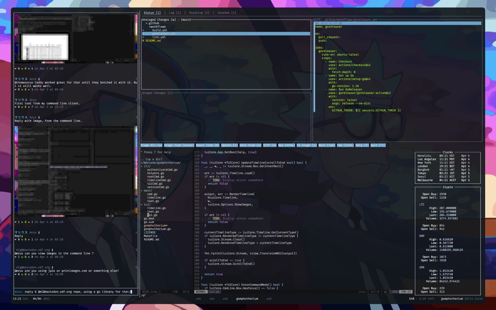

# Gomphotherium

Gomphotherium (*/ˌɡɒmfəˈθɪəriəm/*; "welded beast"), a command line Mastodon 
client.


## Description

Gomphotherium is a Mastodon client for the command line, offering a CLI as well
as a TUI with a usage similar to [rainbowstream](rainbowstream). It is intended
to be used at 80 characters width maximum, but ideally inside [tmux][tmux] as
a sidebar-style program.



[rainbowstream]: https://github.com/orakaro/rainbowstream
[tmux]: https://github.com/tmux/tmux


## Installation

Download a binary from the [releases][releases] page.

Or build it yourself (requires Go 1.16+):

```bash
make
```

[releases]: https://github.com/mrusme/gomphotherium/releases


## User Manual


### Authentication

To authenticate with your Mastodon instance, run the following command and
follow the instructions:

```sh
gomphotherium authenticate https://YOUR-MASTODON-SERVER-URL-HERE.com
```


### TUI

Launch the TUI with the following command:

```sh
gomphotherium tui
```

**Note:** If you haven't exported the required environment variables that were
shown to you during the [Authentication][#authentication], please do so first
or use the CLI flags (`gomphotherium -h`) instead.


#### Modes

The TUI can be operated in two modes: **Normal** and **Command**.

In **Normal** mode no interaction is possible apart from scrolling and 
refreshing the timeline and quitting Gomphotherium. The shortcuts can be looked
up on the [cheatsheet](#cheatsheet)

In **Command** mode, the command input becomes available and scrolling the
timeline is not possible anymore. Commands can then be issued to interact with
the Mastodon instance.


#### Cheatsheet


##### Shortcuts

This is a list of supported keyboard shortcuts. The information in box brackets
tells to which mode the shortcut applies.

`:` [normal] \
Enter **Command** mode

`Esc` [command] \
Leave **Command** mode

`ArrowUp` / `k`, `ArrowDn` / `j` [normal] \
Scroll timeline in either direction by one line

`PgUp`/`b` & `PgDn`/`f` [normal] \
Scroll timeline in either direction by one page

`u` & `d` [normal] \
Scroll timeline in either direction by half a page

`g`, `G` [normal] \
Scroll timeline to the very top/bottom

`Ctrl` + `R` [any] \
Refresh timeline

`Ctrl` + `Q` [any] \
Quit Gomphotherium


##### Commands

`home` \
`local` \
`public` \
`notifications` \
`hashtag`*` tag [local]`* \
Switch between timelines

`whois`*` user`* \
Switch to user profile and timeline

`t`*` content ...`* \
`toot`*` content ...`* \
Publish a new public toot

`tp`*` content ...`* \
`tootprivate`*` content ...`* \
Publish a new private toot

`tu`*` content ...`* \
`tootunlisted`*` content ...`* \
Publish a new unlisted toot

`td`*` content ...`* \
`tootdirect`*` content ...`* \
Publish a new direct toot

`re`*` toot-id content ...`* \
`reply`*` toot-id content ...`* \
Reply to a toot publicly

`rep`*` toot-id content ...`* \
`replyprivate`*` toot-id content ...`* \
Reply to a toot privately

`reu`*` toot-id content ...`* \
`replyunlisted`*` toot-id content ...`* \
Reply to a toot unlisted

`red`*` toot-id content ...`* \
`replydirect`*` toot-id content ...`* \
Reply to a toot directly

`rt`*` toot-id`* \
`retoot`*` toot-id`* \
`boost`*` toot-id`* \
Boost a toot

`ut`*` toot-id`* \
`unretoot`*` toot-id`* \
`unboost`*` toot-id`* \
Undo boosting a toot

`fav`*` toot-id`* \
Fav a toot

`unfav`*` toot-id`* \
Undo fav-ing a toot

`open`*` toot-id`* \
Open toot in system browser

`share`*` toot-id`* \
Copy toot URL to the clipboard

`help` \
`?` \
Show help page

`quit` \
`exit` \
`bye` \
Quit Gomphotherium

**Info:** \
- `content ...` describes the text content of a toot, including 
  [inline shortcodes](#inline-shortcodes)
- `toot-id` describes the toot ID (number) visible on the right side of each 
  toot in the timeline

##### Inline Shortcodes

Inline shortcodes allow to add additional info to toots. They can be added
anywhere in the toot content as they get filtered from the toot before
publishing.

`~!!` \
Mark toot as sensitive; one-time shortcode

`~#[`*`text ...`*`]` \
Add content warning (spoiler) text to toot; one-time shortcode

`~:[`*`/path/to/file`*`]` \
Add media by file path to toot; can be specified multiple times


##### Usage Examples

`home` \
Switch to the home timeline

`hashtag theStudio local` \
Switch to the hashtag timeline and search for the hashtag *#theStudio* on only
the *local* instance

`hashtag lol` \
Switch to the hashtag timeline and search for the hashtag *#lol* globally

`whois mrus@merveilles.town` \
Switch to the profile of *mrus@merveilles.town* and list his toots

`t Hello World!` \
Publish a new public toot that says *Hello World!*

`tp Mondays are fine. It’s your life that sucks. ~#[Controversial joke]` \
Publish a new private toot that says *Mondays are fine. It’s your life that 
sucks.* with a content warning that says *Controversial joke*

`tu Check out my mustache! ~:[/home/user/Photos/awesome_mustache.jpg] ~!!` \
Publish a new unlisted toot with a photo attached to it, that is flagged
sensitive

`re 11 I think so, @brain, but aren't we out of shaving cream?` \
Publicly reply to toot with ID *11* with *I think so, @brain, but aren't we out 
of shaving cream?*

`rt 11` \
Retoot/boost toot with ID *11*

`help` \
Show this help

`bye` \
Goodbye!


### CLI

The CLI interface allows for exectuion of commands right from the terminal
prompt. Not all commands are supported.


#### Usage Examples

`gomphotherium cmd home` \
Render the home timeline

`gomphotherium cmd t Hello World!` \
Publish a new public toot that says *Hello World!*
